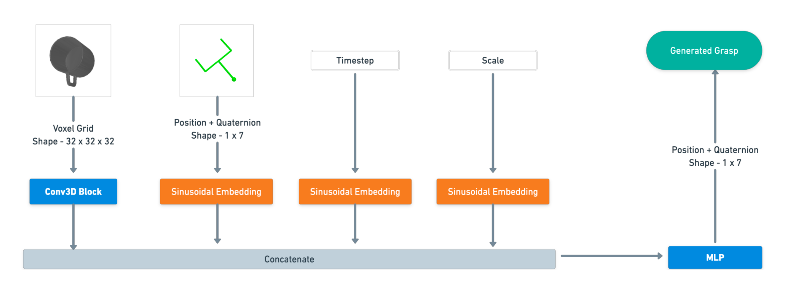

# Diffusion-based Architectures for Robotic Grasping

In this repository, we implement 2 Diffusion (DDPM) models for the purpose of robotic grasping.
The first training script uses the Acronym Dataset. The second training script uses the CONG Dataset.

Authors - [Shashwat Ghatiwala](https://github.com/shashwatghatiwala1/) and [Jingchao Xie](https://github.com/Jchao-Xie/) from [Technical University of Munich](https://www.tum.de/en/)

Structure of the repository - 

- Overfitting a diffusion model on all grasps of one object
- Unconstrained Grasp Diffusion Model
    * Dataset Preparation
    * Training
    * Visualizing Model's outputs
- Constrained Grasp Diffusion Model
    * Dataset Preparation
    * Training
    * Visualizing Model's outputs
- Evaluation using PyBullet

## Model Architecture

## Overfitting 

Before we train the model on the entire dataset, we overfit a diffusion model on all grasps of one object. The purpose of this is to check if our diffusion-based pipeline is working properly

The code for this is in `overfit_1_object.ipynb`

## Unconstrained Model

Dataset used for Grasps - [Acronym Dataset](https://github.com/NVlabs/acronym)  
Dataset for Meshes - [ShapeNetSem meshes](https://shapenet.org/)  
Code to preprocess the acronym dataset is in `utils/prepare_unconstrained_dataset.ipynb`

### Training

See `train_unconstrained_model.py`

### Visualizing Grasps generated by Model

See `visualize_unconstrained_model.ipynb`

## Constrained Model

Dataset used for Constrained Grasps - [CONG Dataset](https://github.com/jsll/CONG/tree/main)  
The main [zipfile](https://huggingface.co/datasets/jens-lundell/cong) is also available on HuggingFace

### Dataset Preprocessing

Code to preprocess the CONG dataset - `utils/prepare_constrained_dataset.ipynb` 
You can check if the preprocessing has been done correctly by visualizing the mask - `utils/visualize_constrained_data.ipynb`

### Training

See `train_constrained_model.py`

### Visualizing Constrained Grasps generated by Model

See `visualize_constrained_model.ipynb`

## Evaluation

We use PyBullet for our model evaluation

## References

* Noise Scheduler and Positional Embeddings from [tiny-diffusion](https://github.com/tanelp/tiny-diffusion/tree/master).